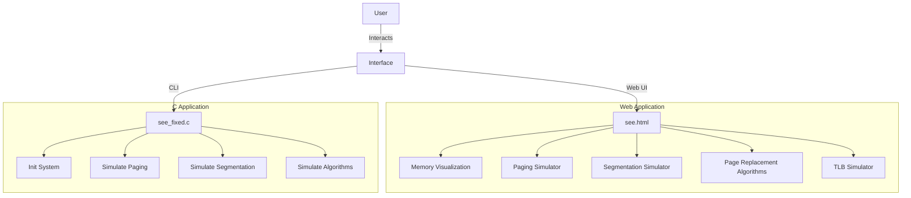
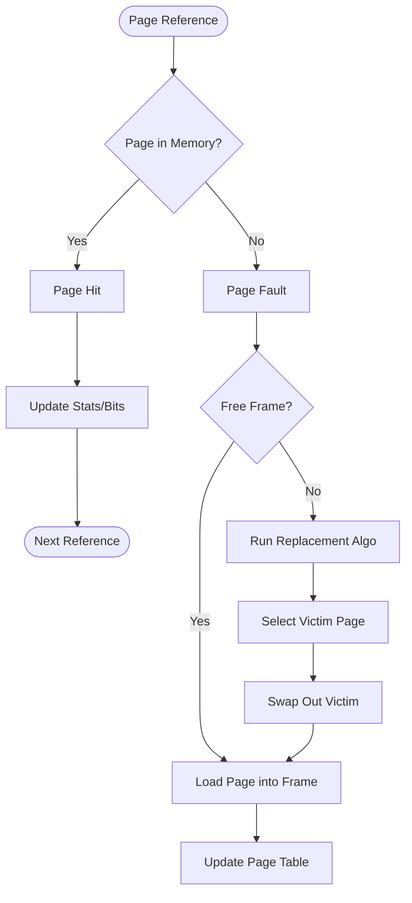

# Memory Management Visualizer & Simulator - Project Report

## 1. Problem Statement
Understanding Operating Systems concepts, particularly **Memory Management**, can be challenging due to their abstract nature. Concepts like **Paging**, **Segmentation**, **Virtual Memory**, and **Page Replacement Algorithms** involve complex data structures and state transitions that are difficult to grasp through theoretical study alone.

Students and developers often struggle to visualize:
- How logical addresses are translated to physical addresses.
- How memory is fragmented (internal vs. external).
- How different page replacement algorithms (FIFO, LRU, Optimal, Clock) make decisions.
- The impact of a Translation Lookaside Buffer (TLB) on effective memory access time.

The problem is to create an interactive tool that bridges this gap by providing both a **visual/graphical interface** and a **detailed command-line simulation** to demonstrate these core OS behaviors in real-time.

---

## 2. Objectives
The primary objectives of this project are:
1.  **Visualize Memory Architecture**: To display physical memory frames, page tables, and segment tables dynamically.
2.  **Simulate Address Translation**: To implement and demonstrate Logical-to-Physical address translation using both Paging and Segmentation mechanisms.
3.  **Compare Algorithms**: To implement and compare various Page Replacement Algorithms (FIFO, LRU, Optimal, Clock/Second Chance) in terms of Page Faults and Hit Ratio.
4.  **Demonstrate Hardware Optimization**: To simulate the Translation Lookaside Buffer (TLB) and visualize its role in reducing effective memory access time.
5.  **Dual-Interface Implementation**: To provide a rich Web-based UI for interactivity and a C-based CLI for understanding low-level implementation details.

---

## 3. Methodology

### 3.1 Technological Stack
The project is implemented using a dual-approach to cater to different learning styles:

#### Frontend (Web Interface - `see.html`)
*   **HTML5**: Provides the semantic structure for the dashboard, form inputs, and simulation containers.
*   **CSS3**:
    *   **Flexbox & Grid**: Used for responsive layouts (Memory Frames Grid, Tables).
    *   **CSS Variables**: Defined in `:root` for consistent theming (Primary, Secondary, Success, Warning colors).
    *   **Animations**: Transitions and transforms for visualizing memory state changes.
*   **JavaScript (Vanilla ES6+)**:
    *   **Core Logic**: Implements the memory management algorithms (FIFO, LRU, Optimal, Clock) directly in the browser.
    *   **DOM Manipulation**: Dynamically renders memory frames and tables without page reloads.
    *   **Event Handling**: Managing user interactions like button clicks and slider changes.

#### Backend (Command Line Interface - `see_fixed.c`)
*   **C Programming Language (C99)**:
    *   **Standard Library**: `<stdio.h>`, `<stdlib.h>`, `<string.h>` for core I/O and string operations.
    *   **Boolean**: `<stdbool.h>` for clarity in logic (e.g., `valid` bits).
    *   **Time**: `<time.h>` for random seed generation (`srand`).
    *   **Low-Level Memory**: Uses `malloc()` and `free()` for dynamic frame allocation.
*   **System Integration**:
    *   **Platform Specific macros**: Handling `cls` (Windows) vs `clear` (Linux) screen clearing.
    *   **ANSI Color Codes**: For colored terminal output to distinguish Page Hits (Green) vs Faults (Red).

### 3.2 Key Modules
1.  **Memory Initialization**: Setup of physical memory frames and process structures.
2.  **Process Management**: Dynamic creation and removal of processes with specific memory requirements.
3.  **Paging Module**: Handles page tables and address translation ($Physical Address = Frame No \times Page Size + Offset$).
4.  **Segmentation Module**: Handles segment tables and bounds checking ($Base + Offset < Limit$).
5.  **Replacement Module**: Implements the victim selection logic when memory is full.

---

## 4. System Flowcharts

### 4.1 Overall System Architecture


### 4.2 Page Replacement Flow


---

## 5. Theory & Code Explanation

### 5.1 Paging & Address Translation
**Theory**: Paging divides memory into fixed-size chunks called **Frames** and logical memory into **Pages**. The CPU generates logical addresses (Page Number + Offset). The OS uses a **Page Table** to map Page Numbers to Frame Numbers.

**Implementation**:
- In `see.html`: The `simulateAddressTranslation` function calculates:
  ```javascript
  logicalAddress = pageNo * PAGE_SIZE + offset;
  physicalAddress = frameNo * PAGE_SIZE + offset;
  ```
- In `see_fixed.c`: Structs define the tables:
  ```c
  typedef struct {
      int page_no;
      int frame_no;
      int valid; // Present bit
      ...
  } PageTableEntry;
  ```

### 5.2 Segmentation
**Theory**: Segmentation divides memory into variable-sized chunks based on logical units (e.g., Code, Stack, Heap). Each segment has a **Base Address** and a **Limit**. Access is valid only if $Offset < Limit$.

**Code Snippet (C)**:
```c
if (offset < processes[p].seg_table[s].limit * 1024) {
    // Valid Access
    printf("Physical Address: %d\n", base + offset);
} else {
    printf("SEGMENTATION FAULT!");
}
```

### 5.3 Page Replacement Algorithms
When memory is full, the OS must evict a page to load a new one.

1.  **FIFO (First-In-First-Out)**:
    *   **Theory**: Replace the oldest page brought into memory.
    *   **Code**: Uses a `queue` or circular index (`fifo_index = (fifo_index + 1) % frames`).
    *   **Pros/Cons**: Simple but suffers from **Belady's Anomaly**.

2.  **LRU (Least Recently Used)**:
    *   **Theory**: Replace the page that hasn't been used for the longest time.
    *   **Code**: Tracks `last_used` timestamp for each frame. Finds `min(last_used)`.
    *   **Pros/Cons**: Good performance, approximates Optimal, but high overhead.

3.  **Optimal**:
    *   **Theory**: Replace the page that will not be used for the longest time in the future.
    *   **Code**: Peeks into the future reference string.
    *   **Note**: Impossible to implement in real OS (requires future knowledge), used as a benchmark.

4.  **Clock (Second Chance)**:
    *   **Theory**: FIFO with a "Reference Bit". If Ref Bit is 1, give it a second chance (reset to 0) and move to next. If 0, replace it.
    *   **Code**: Circular buffer using a `clock_hand` pointer.

### 5.4 Translation Lookaside Buffer (TLB)
**Theory**: The TLB is a small, fast hardware cache inside the MMU that stores recent Page-to-Frame mappings. It avoids the double memory access cost of paging (one for page table, one for data).
**Formula**: $EAT = (Hit Ratio \times TLB Time) + (Miss Ratio \times 2 \times Memory Time)$

---

## 6. Execution & Results

### 6.1 Web Interface (see.html)
The web interface generates a comprehensive dashboard:
*   **Memory Grid**: Visual blocks representing frames (Green=Free, Red=Used).
*   **Translation**: Interactive inputs to see how `0x1A2B` decomposes into Page `1`, Offset `A2B`.
*   **Comparison Graphs**: Real-time stats showing Hits vs. Faults for different algorithms.
*   **TLB Sim**: Visualizes the "Search TLB -> Miss -> Search Page Table -> Update TLB" flow.

### 6.2 CLI Output (see_fixed.c)
The C program provides a robust textual simulation:
```text
================================================================
                    PAGE REPLACEMENT ALGORITHMS
================================================================
Select Algorithm: 2 (LRU)
Page References: 7 0 1 2 0 3 0 4 2 3

Step 1: Ref 7 -> FAULT! Loaded into Frame 0
Step 2: Ref 0 -> FAULT! Loaded into Frame 1
...
Step 5: Ref 0 -> HIT!  (Time updated)
...
Results:
Hits: 6, Faults: 4, Hit Ratio: 60%
```

---

## 7. Conclusion
This project successfully demonstrates the complexity of Operating System memory management. By comparing the simulations:
1.  **Visualization Aids Understanding**: The web view clarifies how fragmentation occurs and how the "Clock" algorithm physically scans frames.
2.  **Algorithm Efficiency**: The simulation consistently shows **Optimal** performing best, followed closely by **LRU**, with **FIFO** often performing worst due to lack of locality awareness.
3.  **TLB Impact**: The TLB simulation proves that even a small cache (e.g., 8 entries) with a high hit rate (90%+) drastically reduces Effective Access Time.

The project encompasses all major aspects of the OS syllabus regarding memory, serving as both a robust educational tool and a competent technical implementation.

---

## 8. Viva Questions & Answers

**Q1: What is the difference between Logical and Physical Address?**
**A:** A Logical Address is generated by the CPU (virtual), whereas a Physical Address is the actual location in the RAM. The Memory Management Unit (MMU) translates Logical to Physical using Page Tables.

**Q2: What is Internal Fragmentation and where does it occur?**
**A:** Internal Fragmentation happens in Paging when a process needs less memory than the allocated page size (e.g., needing 100 bytes but getting a 4KB page). The wasted space inside the page is internal fragmentation.

**Q3: What involves "Belady's Anomaly"?**
**A:** It is a phenomenon in the **FIFO** algorithm where increasing the number of page frames results in *more* page faults. This contradicts the intuition that more memory should equal fewer faults.

**Q4: Why is Segmentation used?**
**A:** Segmentation reflects the user's view of memory (code, stack, heap, data). It allows for better protection (e.g., Read-only code segment) and sharing compared to Paging.

**Q5: What is a Page Fault?**
**A:** A Page Fault occurs when a program tries to access a page that is not currently mapped in Physical Memory (RAM). The OS must interrupt, load the page from the disk (Swap Space), and update the page table.

**Q6: How does the Clock Algorithm differ from FIFO?**
**A:** Clock is basically FIFO but with a "Reference Bit". It gives pages a "second chance"—if a page has been referenced (Ref Bit = 1), it is skipped and its bit is reset, giving it one more cycle to survive before eviction.

**Q7: Usage of TLB?**
**A:** The Translation Lookaside Buffer is a hardware cache used to speed up virtual-to-physical address translation. It stores recent translations so the page table (in main memory) doesn't need to be accessed for every instruction.

**Q8: What is Thrashing?**
**A:** Thrashing occurs when the system spends more time paging (swapping pages in and out) than executing processes. It happens when the degree of multiprogramming is too high and the total working set size exceeds physical memory.

**Q9: What is the purpose of the Modify Bit (Dirty Bit)?**
**A:** It indicates if a page has been written to. If the Dirty Bit is 1, the page must be written back to the disk before replacement. If 0, it can just be overwritten, saving I/O operations.

**Q10: Calculate the Physical Address if Page No=5, Offset=100, and Frame No=8.**
**A:** Physical Address = $Frame No \times Page Size + Offset$. Assuming Page Size = 1KB (1024), $PA = 8 \times 1024 + 100 = 8292$.
